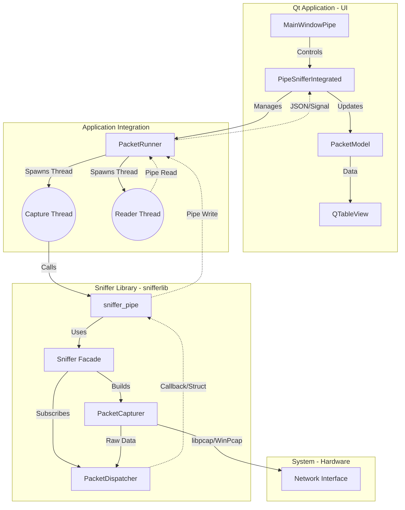

# WireHound

**WireHound** is a cross-platform network packet sniffer and analyzer built with C++, Qt 6, and libpcap. It provides real-time packet capture, protocol analysis (Ethernet, IP, TCP, UDP, ICMP), and an intuitive GUI for monitoring network traffic. Designed with a layered architecture using pipes for IPC, it ensures high performance without blocking the UI.

---

## Overview
This project is a multi-platform network packet analyzer application built with **Qt 6** (C++) for the user interface and **libpcap** (or WinPcap/Npcap on Windows) for the underlying packet capture engine.

The system is designed with a layered architecture that separates the UI concern from the packet capture logic, using pipes for inter-process communication (or intra-process threading in the integrated mode) to ensure stability and performance.

### Key Features
*   **Packet Capture**: Real-time capturing of network packets from selected network interfaces.
*   **Protocol Analysis**: Parsing of Ethernet, IP, TCP, UDP, and ICMP headers.
*   **Live Visualization**: A responsive Qt-based table view showing live packet traffic.
*   **Search & Filtering**: Capability to filter packets by IP, Prototocl, Port, etc.
*   **Cross-Platform**: Designed to work on macOS, Linux, and Windows.

## Architecture

The system follows a Producer-Consumer pattern bridged by a pipe (or equivalent logic), ensuring the high-speed capture loop does not block the UI.

### Component Diagram



### Flow Description

1.  **User Interface (UI)**: The `MainWindowPipe` initiates capture commands.
2.  **Controller**: `PipeSnifferIntegrated` acts as the bridge, managing the `PacketRunner`.
3.  **Runner**: `PacketRunner` sets up the execution environment (pipes/threads).
4.  **Capture Core**:
    *   The `sniffer_pipe` entry point initializes the modern `Sniffer` class.
    *   `Sniffer` configures a `PacketCapturer` (Producer) and `PacketDispatcher` (Consumer).
    *   Packets are captured, parsed into a `tagSnapshot` struct, and written to a pipe/socket.
5.  **Data Consumption**:
    *   The `ReaderThread` in `PacketRunner` reads the struct from the pipe.
    *   It converts the data into a JSON string (or internal object).
    *   The data is passed back to the UI thread via Qt Signals (`packetReceived`).
6.  **Visualization**: `PacketModel` receives the data and updates the `QTableView`.

## Usage
### Prerequisites
*   CMake
*   Qt 6
*   libpcap (macOS/Linux) or Npcap SDK (Windows)

### Build
```bash
mkdir build
cd build
cmake ..
make
```

### Run
```bash
./app/WireHound
```
